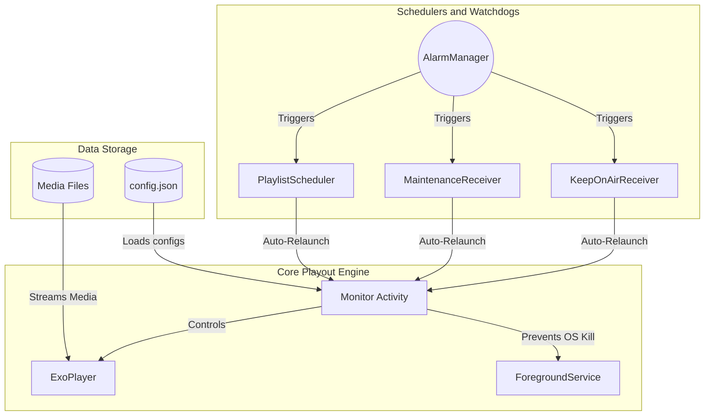

  

  # Telefyna
  
  **The ultimate 24/7 online streaming & local file scheduling auto-player for Unattended TV Broadcasting.**

---

## 🚀 Overview

Telefyna is a highly resilient, automated media playout engine built for Digital Signage and TV Broadcasting. It runs completely unattended, scheduling and playing local folders and online streams according to your `config.json`. 

> [!IMPORTANT]
> **Built for 24/7 Resilience:** Telefyna is specifically engineered to survive aggressive Android TV Box hardware. It uses Foreground Services, Keep-Screen-On Wakelocks, and triple-redundant AlarmManager Watchdogs to ensure your broadcast never goes black.

---

## 🏗 Architecture

---

## ⚙️ Installation & Setup

1. **Install:** Download the APK and install it on your Android TV Box.
2. **Permissions:** Grant the app **Storage** permissions.
3. **Configuration:** Use the [Online Configuration Tool](https://avventomedia.org/telefynaConfiguration/) to generate your `config.json`.
4. **Local Storage:** Place your `config.json` and a `playlist/` folder inside a folder named `telefyna` on the root of your device's internal storage or SD Card.
5. **Reloading:** To force a manual reload of configurations, create a blank file named `init.txt` in the `telefynaAudit` folder.

> [!NOTE]
> Ensure the device's Date and Timezone are set correctly, as all playlist scheduling is highly time-dependent!

---

## 🛠 Features & Capabilities

### Playlists & Fallbacks
* **Primary Default:** The first playlist is the default filler if nothing else is scheduled.
* **Secondary Default:** The second playlist acts as an offline fallback if internet streaming (`ONLINE`) fails.
* **Resuming:** Both defaults must be kept active. If they are local files, it is highly recommended to set them to resuming.
* **Ad Bumpers:** Play bumpers (ads, promos) before `LOCAL_SEQUENCED` or `LOCAL_RANDOMIZED` playlists. Place them in the `bumper/` folder.

### 24/7 Resilience & Auditing
* **Auto-Recovery:** If the Android OS forcefully kills the app to save memory, one of the three watchdogs (`KeepOnAirReceiver`, `PlaylistScheduler`, or `MaintenanceReceiver`) will instantly revive it.
* **Audit Logs:** Telefyna continuously writes daily logs to the `telefynaAudit` folder on the root of the device.
* **Forensic Crash Tracing:** On Android 11+, if the TV Box OS kills the app, Telefyna queries the `ApplicationExitInfo` API upon waking up and logs the *exact hardware reason* (e.g., `LOW_MEMORY`, `CRASH`) directly to the daily log file.

### Remote Management
* Use FTP clients like [FileZilla](https://filezilla-project.org/) or [RustDesk](https://rustdesk.com/) to upload revised `config.json` files and media remotely.
* Alternatively, auto-sync folders using [Syncthing](https://syncthing.net/).

---

## 📈 Roadmap / To Do

### Industry Standard TV / Digital Signage Features
- [ ] **Hardware Watchdog Integration:** Support for hardware-level watchdogs (pinging `/dev/watchdog`) in case the entire Android OS freezes.
- [ ] **Remote Screen Monitoring:** Capture and stream screenshots/thumbnails to a remote dashboard to verify the TV is actively displaying content.
- [ ] **Dynamic Content Updates (Push):** Support WebSockets or Firebase Cloud Messaging (FCM) to instantly push playlist changes without waiting for midnight maintenance.
- [ ] **Device Metrics Reporting:** Log CPU temperature, free RAM, and storage health to the audit logs to predict hardware failures.
- [ ] **Fallback Local Caching:** Automatically download and cache a rolling 24-hour window of `ONLINE` stream segments in case the internet goes down completely.
- [ ] **HDMI CEC Control:** Support turning the physical TV screen on/off via HDMI-CEC commands based on business hours.

### Existing Backlog
- [ ] Auto-installation of config under resources if non-existent at first run.
- [ ] Create a `LOCAL_RANDOMIZED` special mode which loads folders and plays one at a time.
- [ ] Enhance resuming playlists (`LOCAL_RESUMING*`) to track the actual filename (`mediaId`) instead of just the index, preventing playlist resets or skipped episodes when files are added or removed from the folder.
- [ ] Test if dates down the playlist overwrite the schedule.
- [ ] Test playlist modification, etc.
- [ ] Handle current play at switch not buffering video.
- [ ] Log every keypress.
- [ ] Fix Swift bug: don't override, just replace manually.
- [ ] Investigate bumpers missing when loaded from scheduler.
- [ ] Handle player idling on stream; resume play/seekTo.
- [ ] Add support for automatic drive syncing.
- [ ] **Urgent:** Connecting Bluetooth plays fillers? (17 Mar 21, 18:15). Also, player switches but plays only audio at 18:30.
- [ ] Support YouTube links and streams.
- [ ] Build reports from audits.
- [ ] Read satellite channels and decoders as local playlists and streams.
- [ ] Support streaming to HLS, Shoutcast, and Loudcast.

---

## ✅ Solved Issues & Completed Updates

### 2026 - August
- [x] **[SOLVED] Automated Testing & CI/CD:** Integrated a comprehensive JVM unit testing suite (MockK, JUnit) for core business logic (Scheduling, AuditLogs, Configs) and deployed automated GitHub Actions to verify tests on every Push and PR to `main`.

### 2026 - July
- [x] **[SOLVED] SRT Stream Support:** Integrated custom `SrtDataSource` & `SrtDataSourceFactory` powered by `srtdroid-core` ([ExoPlayer Issue #8647](https://github.com/google/ExoPlayer/issues/8647)) to support `srt://` protocol playback *(pending end-to-end field testing)*.
- [x] **[SOLVED] 24/7 Resilience Update:** Prevented aggressive Android OS memory kills by converting `Monitor` to use `FLAG_KEEP_SCREEN_ON` and attaching a persistent `TelefynaForegroundService`.
- [x] **[SOLVED] Auto-Recovery Watchdogs:** Rewrote `KeepOnAirReceiver`, `MaintenanceReceiver`, and `PlaylistScheduler` as manifest-registered broadcast receivers to wake the app from total process death.
- [x] **[SOLVED] Single Instance UI:** Fixed app relaunching opening a new/duplicate instance rather than resuming. Handled using `FLAG_ACTIVITY_SINGLE_TOP` in recovery intents.
- [x] **[SOLVED] Forensic Audit Logging:** Added stop/kill audit events. Integrated Android 11 `ApplicationExitInfo` into `Logger.kt` to write exact hardware/OS kill reasons directly to the `telefynaAudit` daily text logs.
- [x] **[SOLVED] Midnight Runner Fix:** Tested and fixed the midnight runner by decoupling it from the fragile `Activity` context and moving it to a hardened `BroadcastReceiver`.

### 2025 - January
- [x] **[SOLVED]** Rename "clone" with "schedule".
- [x] **[SOLVED]** Add "promos/sweepers/something" folder that starts the playout.
- [x] **[SOLVED]** Network listener: switches to second default when internet is off, and back if slot is still active.
- [x] **[SOLVED]** Add continuing play without seek to `LOCAL_RESUMING_NEXT`.
- [x] **[SOLVED]** Support audit logs; mail them out.
- [x] **[SOLVED]** Reload configurations at midnight.
- [x] **[SOLVED]** Default back to the first playlist if the local playlist completes before end time.
- [x] **[SOLVED]** Fix `BehindLiveWindowException` on HLS streaming.
- [x] **[SOLVED]** Build a schedule GUI builder & viewer for `config.json`.
- [x] **[SOLVED]** Support RTMP format.
- [x] **[SOLVED]** Overlay another layer on the video stream for ads, logos, gifs, etc.
- [x] **[SOLVED]** Add smooth and fade transitions between programs switches.
- [x] **[SOLVED]** Add Custom scroll ticker with time.

### 2025 - March
- [x] **[SOLVED]** Support gifs in showing logo and watermarks.

---

**Author:** AvventoProductions  
**Support:** apps@avventomedia.org